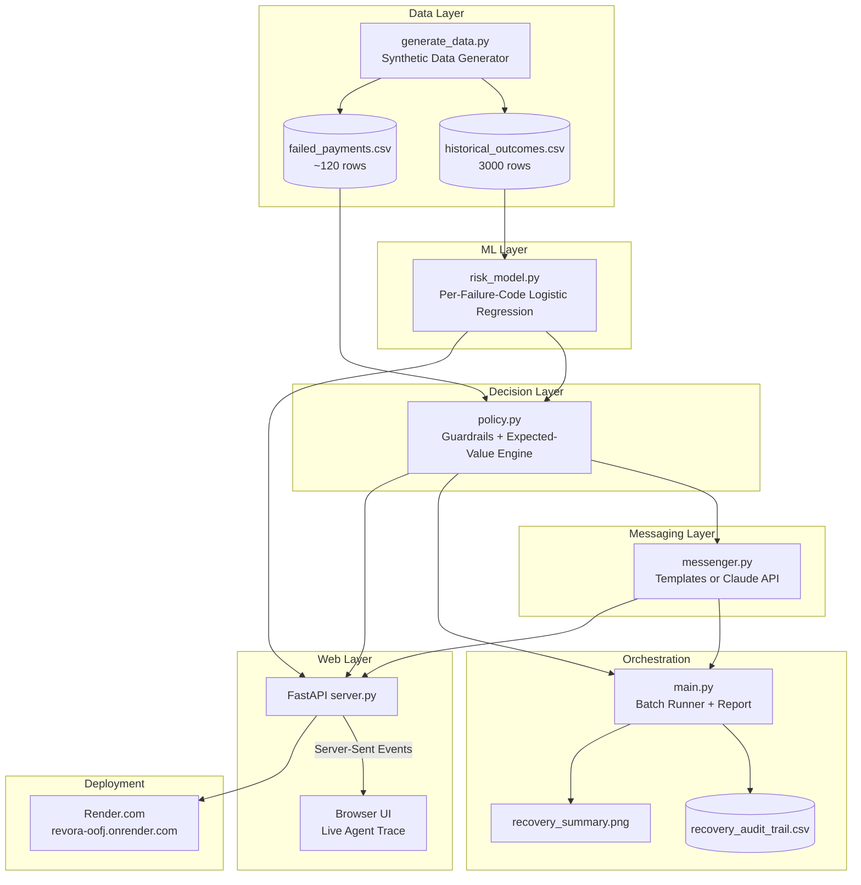
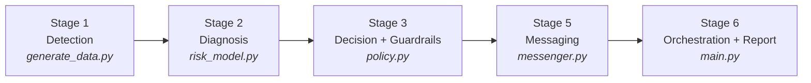
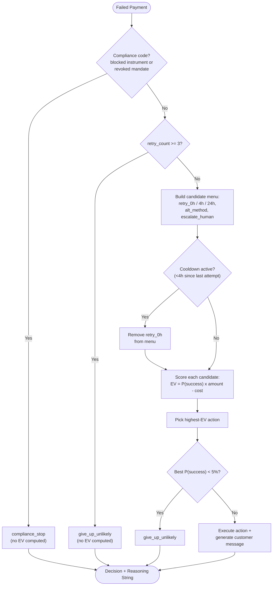

# Revora

**AI Payment Recovery Agent** — built for Razorpay Buildathon, Track 03: *AI Revenue Recovery*.

🔗 **Live demo**: [https://revora-oofj.onrender.com](https://revora-oofj.onrender.com)
📦 **Repo**: [github.com/drajhans951-boop/revenue-recovery-agent](https://github.com/drajhans951-boop/revenue-recovery-agent)

> First visit to the live demo may take 30-50s to wake up (free-tier hosting sleeps after inactivity) — refresh if the first load times out.

---

## Table of Contents

1. [What problem this solves](#what-problem-this-solves)
2. [What it actually does](#what-it-actually-does)
3. [Key features](#key-features)
4. [System architecture](#system-architecture)
5. [Pipeline flow](#pipeline-flow)
6. [Decision & guardrail logic](#decision--guardrail-logic)
7. [The math, in plain terms](#the-math-in-plain-terms)
8. [Model rigor & evaluation](#model-rigor--evaluation)
9. [Data provenance](#data-provenance)
10. [Tech stack](#tech-stack)
11. [Project structure](#project-structure)
12. [How to run](#how-to-run)
13. [Deployment](#deployment)
14. [What to demo](#what-to-demo)
15. [Anticipated questions & known limitations](#anticipated-questions--known-limitations)

---

## What problem this solves

Payments fail constantly — insufficient funds, network timeouts, declined cards, blocked instruments, revoked mandates. Most systems respond to this in one of two bad ways: **give up** on the revenue entirely, or **retry blindly**, wasting money contacting customers who were never going to convert — or worse, retrying a lost/stolen card or a revoked mandate, which isn't just wasteful, it's a compliance problem.

**Revora** is an agent that looks at a batch of failed payments and, for each one, decides:
- **Whether** it's worth trying to recover at all
- **How** to recover it (automatic retry, a payment-method nudge, or human escalation)
- **When to stop** — under hard guardrails that no scoring bug or bad prediction can override

And then it proves the result with real numbers: revenue at risk vs. revenue actually recovered, verified against held-out data, with a full per-transaction audit trail.

## What it actually does

For every failed payment in a batch, Revora:
1. **Diagnoses** the odds of recovery using a model trained specifically for that failure type (a card decline behaves nothing like a network timeout — more below)
2. **Decides** the single highest-expected-value action from a fixed menu, *after* passing it through compliance guardrails that run before any scoring
3. **Phrases** a short customer message (English or Hinglish) for whatever action was decided — never deciding on its own whether to contact someone
4. **Reports** the measured outcome: total revenue recovered, action breakdown, failure-reason breakdown, and a full audit trail with a plain-English reasoning string for every single decision

## Key features

**Detection & Diagnosis**
- Synthetic data generator producing realistic historical outcomes and a current failed-payments batch
- Six failure categories aligned to Razorpay's real, publicly documented error reasons (not invented from scratch — see [Data Provenance](#data-provenance))
- **One statistical model per failure code**, not one shared model — because different failure types move in opposite directions over time (see [The Math](#the-math-in-plain-terms))
- Feature-rich risk model: hours since failure, retry count, payment method, subscription status
- Automatic fallback to a simple historical-average rate for low-data failure codes, rather than overfitting a model to noise
- A built-in sanity check that verifies every model's predicted direction (across both hours *and* retries) matches real-world intuition — this check actually caught a real bug during development (see [Known Limitations](#anticipated-questions--known-limitations))

**Decision Engine**
- Expected-value ranking across a fixed menu of 5 actions — never an open-ended/unbounded choice
- Four hard-coded guardrails, two hard (checked first, no math computed at all if they fire) and two soft (constrain which actions are even considered)
- Every decision — from every branch — carries a human-readable reasoning string

**Messaging**
- Strict separation of concerns: the messaging layer only *phrases* an action already decided elsewhere — it never decides whether to contact someone
- English and Hinglish templates, fully offline by default
- Optional live generation via the Claude API, with automatic fallback to templates if it fails

**Reporting & Audit**
- Batch-level report: revenue at risk vs. recovered, recovery rate, action breakdown, **and** failure-reason breakdown
- Full CSV audit trail — every transaction, every decision, every reasoning string, whether it recovered
- Summary chart (revenue at risk vs. recovered, and recovered revenue by failure code)

**Model Rigor**
- 5-fold cross-validation (not a single lucky/unlucky split) for every accuracy claim in this project
- A naive "just guess the historical average" baseline, so it's provable the model adds real value
- A full calibration table — proving "60% predicted" really does mean "succeeds ~60% of the time"
- An honest feature-value comparison (does adding `payment_method`/`is_subscription` actually help? — reported truthfully even when the answer is "barely")

**Live Web Demo**
- FastAPI backend wrapping the exact same Python modules as the CLI — zero duplicated logic
- Live, streaming "agent trace" (via Server-Sent Events) showing each decision as it's made, not a static dump
- Interactive tabs: revenue breakdown by failure code, live model calibration, live guardrail-test results
- Deployed publicly on Render, auto-redeploying on every push

**Testing**
- A dedicated pytest suite that tries to *break* every guardrail on purpose — huge amounts, favorable-looking history — and proves it holds anyway

---

## System architecture



No logic is duplicated between the CLI and the web app — `server.py` imports the same `generate_data`, `risk_model`, `policy`, `messenger`, and `main` modules directly.

## Pipeline flow



| Stage | File | What it does |
|---|---|---|
| 1. Detection | `generate_data.py` | Synthesizes `historical_outcomes.csv` (3000 past retries with known outcomes) and `failed_payments.csv` (the current batch of ~120 failed payments). Also defines `true_success_probability`, the hidden ground-truth curve per failure code. |
| 2. Diagnosis | `risk_model.py` | Fits one logistic regression **per failure code** on `[hours_since_failure, retry_count, is_subscription, payment_method one-hots] → success`. Runs a diagnostic comparing accuracy with vs. without the extra features, per code. |
| 3. Decision + guardrails | `policy.py` | Hard guardrails run first (no scoring at all if they fire); otherwise scores a fixed menu of actions by expected value and picks the best, subject to soft guardrails. |
| 5. Messaging | `messenger.py` | Turns an already-decided action into a short customer message (English or Hinglish). Never makes contact decisions itself. |
| 6. Orchestration | `main.py` | Runs the whole batch, simulates real outcomes against the hidden ground truth, prints a report, saves the audit trail CSV and summary chart. |
| — | `test_guardrails.py` | pytest suite that tries to break every guardrail. |
| — | `calibration_check.py` | 5-fold cross-validation: mean/std accuracy (overall and per code) vs. a naive per-code-average baseline, plus a fold-averaged calibration table. |
| — | `fetch_test_mode_sample.py` | Optional: pulls real Razorpay Test Mode error responses, if test API keys are provided. |

*(There's no separately-numbered Stage 4 — its guardrail logic is folded directly into Stage 3.)*

## Decision & guardrail logic



This recovery workflow is deliberately **bounded** (only ever picks from a fixed menu of 5 actions, never invents a new one) and **gated** by guardrails that run before any expected-value math:

**Hard guardrails** (checked first, return immediately, zero EV computation):
1. **Compliance stop** — a blocked instrument or revoked mandate is hard-coded to `compliance_stop`, forever, no exceptions.
2. **Max-attempts ceiling** — `retry_count >= 3` forces `give_up_unlikely` regardless of predicted odds.

**Soft guardrails** (constrain which candidates are even considered):
3. **4-hour cooldown** — no immediate re-contact offered within 4 hours of a prior attempt.
4. **Give-up floor** — if even the best-scoring candidate has `P(success) < 5%`, override to `give_up_unlikely` rather than spend money on a near-hopeless contact.

Every one of these four is exercised by a dedicated pytest in `test_guardrails.py` that deliberately constructs the *most tempting possible scenario* (huge amount, favorable-looking history) for the guardrail to fail — and confirms it holds anyway. This is the evidence that the bounds are structural, not just usually-true heuristics.

## The math, in plain terms

**Why a separate model per failure code, not one shared model?**

A single logistic regression with one "hours since failure" coefficient can only point in one direction. But `insufficient_funds` gets *more* likely to succeed the longer you wait (the customer tops up their account), while `payment_timed_out` gets *less* likely (it was a one-off glitch — there's nothing to wait for). One shared coefficient can't be both positive and negative, so a shared model would learn the wrong direction for at least one code. Fitting one model per code lets each capture its own time-trend correctly.

A blocked instrument or revoked mandate is **never** modeled statistically — hard-coded to `P(success) = 0.0`, because it's a compliance rule, not a probability to be estimated.

**Expected value formula**

```
EV(action) = P(success) × amount − cost(action)
```

| Action | Typical cost | Notes |
|---|---|---|
| `retry_0h` / `retry_4h` / `retry_24h` | ~₹1 | Automatic retry at different delays |
| `send_reminder_alt_method` | ~₹3 | Multiplies model probability by 0.8 (needs customer action) |
| `escalate_human` | ~₹45 | Only considered above ₹5,000; multiplies probability by 1.1 (human touch converts slightly better) |

The policy picks whichever candidate has the highest EV, after guardrail filtering.

## Model rigor & evaluation

Every accuracy number in this project is backed by **5-fold cross-validation**, not a single train/test split — a single split turned out to be genuinely misleading during development (an earlier version showed a "+0.040 accuracy gain" from new features that shrank to +0.002, within noise, once properly cross-validated).

- **Naive baseline comparison**: the model is benchmarked against a dumb "just use this code's historical average rate" predictor, so it's provable the model adds real value, not just complexity.
- **Calibration table**: predictions are bucketed (0-20%, 20-40%, ... 80-100%) and compared against actual observed success rates in held-out data — confirming "60% predicted" really does mean "succeeds ~60% of the time."
- **Honest feature-value reporting**: adding `payment_method`/`is_subscription` is evaluated per failure code, and the result is reported truthfully even when it's underwhelming — see [Known Limitations](#anticipated-questions--known-limitations) for the full story.

## Data provenance

**This is SYNTHETIC data.** No real Razorpay transactions, merchants, or customers are involved anywhere in this project.

What **is** real: the six-code failure taxonomy is aligned to Razorpay's actual, publicly documented payment error reasons ([payments error list](https://razorpay.com/docs/errors/payments/list/), [card errors](https://razorpay.com/docs/errors/payments/cards/)):

| Our code | Status | Real Razorpay reason |
|---|---|---|
| `insufficient_funds` | Exact match | `insufficient_funds` |
| `payment_timed_out` | Renamed to match | Real documented reason |
| `card_declined` | Renamed to match | Real reason, used as our closest generic-decline analogue |
| `debit_instrument_blocked` | Renamed to match | Closest real equivalent to a lost/stolen card |
| `do_not_honor` | Kept, internal-only | No exact real equivalent documented |
| `mandate_revoked` | Kept, internal-only | Only mandate *creation*-failure reasons exist, not revocation |

What is **not** real: the success-rate curves and every row in the generated CSVs are simulated — real production data wasn't available for this hackathon. No claim is made anywhere that the probabilities or revenue figures reflect actual Razorpay outcomes.

`fetch_test_mode_sample.py` is a separate, optional script that can pull real Razorpay **Test Mode** error payloads if you provide test API keys — unrelated to the synthetic pipeline, provided purely for inspection.

## Tech stack

| Layer | Tool |
|---|---|
| Language | Python 3 |
| Data | pandas, numpy |
| ML | scikit-learn (Logistic Regression + StandardScaler) |
| Testing | pytest |
| Charts | matplotlib |
| Optional AI messaging | Anthropic API (`claude-sonnet-4-6`) |
| Web backend | FastAPI + Uvicorn |
| Live streaming | Server-Sent Events |
| Frontend | Plain HTML / CSS / JavaScript (no framework) |
| Deployment | Render.com |
| Version control | Git + GitHub |

## Project structure

```
Razorpay_Track03_project/
├── render.yaml                      # Render deployment blueprint
├── revenue_recovery/
│   ├── generate_data.py             # Stage 1: synthetic data + hidden ground truth
│   ├── risk_model.py                # Stage 2: per-code risk models
│   ├── policy.py                    # Stage 3: guardrails + EV decision engine
│   ├── messenger.py                 # Stage 5: customer messaging
│   ├── main.py                      # Stage 6: orchestration + reporting
│   ├── test_guardrails.py           # Guardrail-breaking pytest suite
│   ├── calibration_check.py         # 5-fold CV accuracy + calibration
│   ├── fetch_test_mode_sample.py    # Optional real Razorpay Test Mode fetch
│   ├── README.md                    # Full technical deep-dive
│   ├── requirements.txt
│   └── webapp/
│       ├── server.py                # FastAPI backend
│       └── static/
│           ├── index.html
│           ├── style.css
│           └── app.js
```

## How to run

**CLI pipeline:**
```bash
cd revenue_recovery
python3 -m venv ../venv
source ../venv/bin/activate
pip install -r requirements.txt

python generate_data.py          # Stage 1
python risk_model.py             # Stage 2 + sanity checks
python main.py                   # Full batch run + report
python -m pytest test_guardrails.py -v
python calibration_check.py      # 5-fold CV
```

**Web UI (local):**
```bash
cd revenue_recovery/webapp
../../venv/bin/uvicorn server:app --reload --port 8000
```
Open `http://localhost:8000`, click **New Batch** → **Run Agent**.

Optional: set `ANTHROPIC_API_KEY` for live AI-generated messages (falls back to templates automatically if unset or if the call fails).

## Deployment

Live on **Render.com**: [https://revora-oofj.onrender.com](https://revora-oofj.onrender.com)

Deployment is defined entirely in [`render.yaml`](render.yaml) — a one-click Blueprint deploy that installs dependencies fresh and runs the same FastAPI app. Every push to `main` auto-redeploys. See `render.yaml` for the exact build/start commands.

## What to demo

1. **The guardrail tests** (`pytest test_guardrails.py -v`, or the live "Guardrail Tests" tab) — each test deliberately constructs the most tempting scenario for a guardrail to fail, and shows it holds anyway.
2. **The 5-fold cross-validated calibration table** — mean/std accuracy vs. a naive baseline, proving the model adds real value, plus proof that predicted probabilities match reality.
3. **The feature-value comparison** — an honest report on whether richer features actually helped, including admitting when they barely did.
4. **The audit trail CSV** — every decision, including the ones that didn't pay off, with a plain-English reasoning string.
5. **The live web demo** — watch the agent process a batch transaction-by-transaction in real time via the streaming trace.

## Anticipated questions & known limitations

Answered here directly rather than left for a judge to discover:

- **"Is this really an agent, or just a rules+ML pipeline?"** By design, mostly the latter — deliberately so. The brief explicitly asks for a *bounded*, *gated* workflow, not an open-ended autonomous one. In a payment-retry context, more autonomy is a liability: an LLM freely deciding whether to retry a blocked card would be strictly worse than a hard-coded rule that can never be talked out of stopping. The "agentic" part is real but scoped: diagnosing odds per code, ranking a fixed action menu by expected value, and (optionally) writing the customer message dynamically — all inside guardrails built to never be overridden by the model.
- **"Why logistic regression instead of XGBoost/a neural net?"** Interpretability and auditability. Each per-code model has 2-7 coefficients that can be read directly, which matters when the output feeds a compliance-adjacent decision. The relationships being modeled (roughly monotonic curves) don't need a high-capacity model's nonlinearity either.
- **"What happens with a failure code the model has never seen?"** Defaults to `P(success)=0.0`, which combined with the 5% give-up floor means the agent safely gives up rather than guessing. `risk_model.py` prints a warning per unrecognized code, since in production this usually means the upstream error taxonomy changed.
- **"Is the model calibrated at high confidence (80-100% predicted)?"** Not testably in this dataset — no failure code's predicted probability ever reaches that range, so that calibration bucket is empty by construction, not unlucky sampling.
- **"Your costs (₹1/₹3/₹45) and thresholds (₹5,000 escalation, 5% give-up) are hardcoded — how would a real deployment set these?"** They're illustrative constants standing in for real operational cost data a merchant would plug in from their own finance/ops numbers — isolated at the top of `policy.py` specifically so they're easy to find and replace.
- **"Does this account for RBI/NPCI rules on recurring-payment (e-mandate/UPI Autopay) retries?"** No — a real gap. `MAX_RETRY_COUNT=3` is a generic guardrail, not derived from actual regulatory retry-limit requirements. A production version would need a mandate-specific guardrail layered on top.
- **"Your feature comparison shows barely any accuracy gain from `payment_method`/`is_subscription` — why add them?"** Because the honest answer to "did they help" is itself the deliverable — the value is in measuring and disclosing this rigorously, not in guaranteeing every feature pays off.
- **"How does this scale to millions of transactions/day?"** It doesn't, as written — models are refit from a CSV in-memory on every run. A production version would separate offline model training (batch, versioned, drift-monitored) from online serving (fast lookup against an already-fitted model), intentionally out of scope for a synthetic-data hackathon submission.

---

For the complete technical deep-dive (full data generation details, every design decision, complete API reference), see [`revenue_recovery/README.md`](revenue_recovery/README.md).
